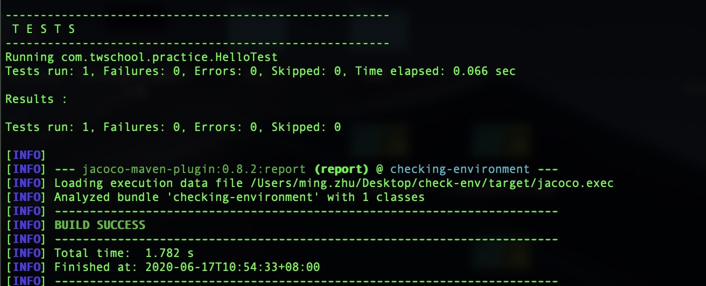
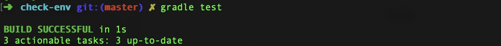

# Checking Integration Environment
验证环境是否集成成功

## Maven验证
以下两个命令至少有一个是成功执行，并得到如下的控制台截图

```bash
mvn test -U
./mvnw test -U
```

## Gradle验证
以下两个命令至少有一个是成功执行，并得到如下的控制截图

```bash
gradle test
./gradlew test
```